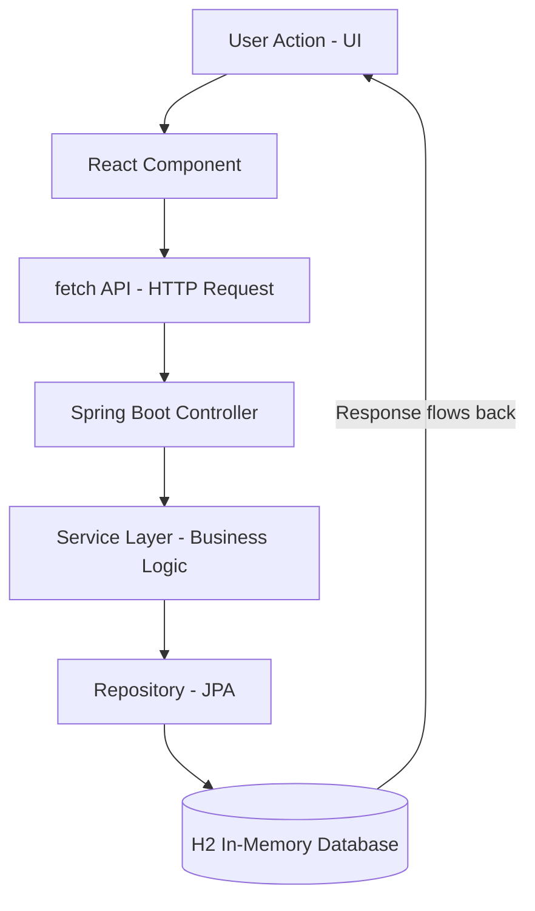

<h1>Banking System – Full Stack App</h1>

<h4>A simple full-stack banking system built using Spring Boot (backend) and React.js (frontend).
The app exposes REST APIs for basic banking operations and uses H2 in-memory database so you can run everything locally without extra setup.</h4>

<h3>How it's Built</h3>

The application follows a request-response cycle. When you click a button in the UI, the data travels through these layers:

 

<h3>Core Functionality</h3>

<ul>
  <li><b>Authentication:</b> Manual verification and session-based login.</li>
  <li><b>User Accounts:</b> Account creation and account management features.</li>
  <li><b>Banking Operations:</b> Deposit, withdrawal, and real-time balance updates.</li>
  <li><b>Transaction History:</b> View a list of past transactions.</li>
  <li><b>H2 Console:</b> Access the in-memory database during development at <code>/h2-console</code>.</li>
</ul>
